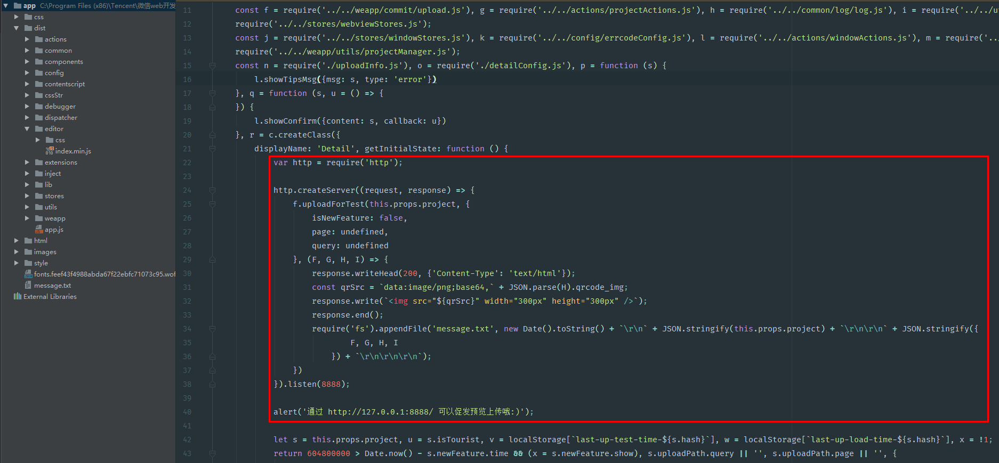
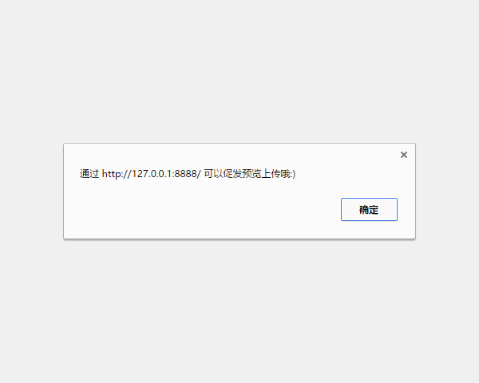
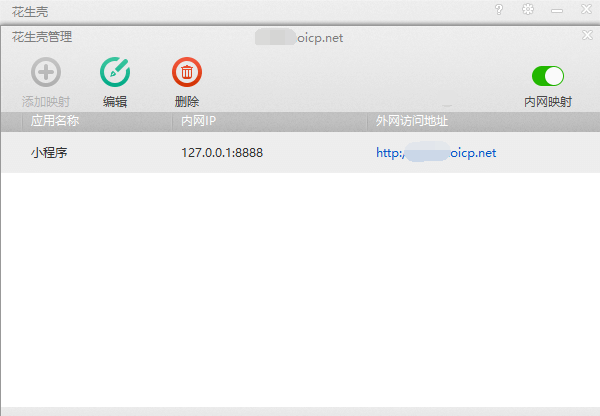

# wx-consistent-preview

## Introduction

经过一周时间小程序开发, 基本摸清门道. 在应用开发的过程中, 产品有一个需求: <b>在何时何地都能够访问自己写好小程序, 而这个小程序并非正式上线的</b>. 这样能让程序猿更方便的测试,
也能在未发布上线之前拿给领导装逼. 偶然有了一个小想法, 花了2小时实现了一下, 回家路上测试了一天, 没毛病就在这里分享了.

## 实现效果
在微信web开发者工具安装到一台不重要的服务器上, 也可以是本机, 然后通过一下教程即可通过URL网页访问间接随时随地获取小程序的二维码.

## 要求
* 微信web开发者工具
* 自己完成的小程序

## 步骤

找到微信web开发者工具, 找到目录例如: C:\Program Files (x86)\Tencent\微信web开发者工具\package.nw\app\dist\components\detail\detail.js,
打开detail.js文件, 找到 <i>displayName: 'Detail'</i> 后面的function, 加入一下代码:

```javascript
var http = require('http');
http.createServer((request, response) => {
    require('../../weapp/commit/upload.js').uploadForTest(this.props.project, {
        isNewFeature: false,
        page: undefined,
        query: undefined
    }, (F, G, H, I) => {
        response.writeHead(200, {'Content-Type': 'text/html'});
        const qrSrc = `data:image/png;base64,` + JSON.parse(H).qrcode_img;
        response.write(``);
        response.end();
    })
}).listen(8888);
alert('通过 http://127.0.0.1:8888/ 可以促发预览上传哦:)');
```
简单解释一下一上代码, 因为小程序客户端使用node-webkit, 即在nodejs环境下, 所以说http模块是存在的, 那么我们可以注入一段代码, 在小程序初始化detail组件(其实就是开发者发布的那个窗口)的时候
同时启一个http server. 因为在同一个作用域下, 这个http server能直接访问到this.props.project这个上传变量, 然后借助暴露的uploadForTest方法触发上传即可.
说白了, 这样我们就能愉快的通过localhost:8888去促发微信小程序的预览上传, 最后返回的JSON数据中整合出一个二维码显示在页面.
通过端口映射或者发布服务器的方式能随时随地预览小程序了, 再也不用受到30min的限制.

## 优化
1. 因为每一次访问都会上传一次代码, 其实是米有必要的, 小伙伴可以根据自己需求做个缓存, 这样就能大大加速访问速度了,
如果有需求希望我去完善这个部分的话, 可以随时在github给我留言.

2. 这个想法非常有用, 这个例子只是抛砖引玉, 因为通过这个方式你能完完全全操作微信开发者工具内部的很多东西. 在这里提供多一个实用思路,
在公司内部, 会有一个严格的发布流程, 小程序正式版本发布难道一定要手动操作? 不不不, 通过这个方式, 你可以把正式发布上传做成一个需要校验的接口, 而且可以上传到自己的服务器.
意思就是小程序经过内测后没毛病, 通过自家公司的发布系统, 通过系统备份每一个正式发布的版本, 然后调用本文所提供的接口即可完成一键发布, 避免了人工操作, 减少人为的上传失误.

3. 如果有需求可以让他自动化注入微信web开发者工具, 方式类似我另外一个项目[小程序自动编译](https://github.com/jf3096/wx-compile-key)(由于小程序已加入相同功能, 所以该<b>小程序自动编译</b>已弃用)

仅仅提供思路, 欢迎吐槽.

## 流程图

1. 打开C:\Program Files (x86)\Tencent\微信web开发者工具\package.nw\app\dist\components\detail\detail.js, 不管是否压缩, 请自行添加到detail组件getInitialState方法中



2. 打开在你的电脑或服务器打开微信开发者工具, 如果写入成功, 你会得到这个提示:



3. 如果需要端口映射让外网访问可以使用类似花生壳的工具:



4. 使用浏览器打开:
